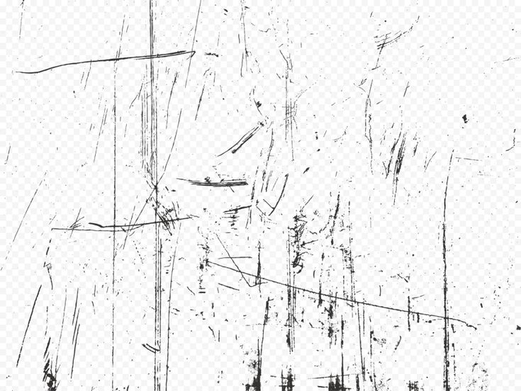

--
## Requirements
- [Lovely](https://github.com/ethangreen-dev/lovely-injector) injector -- Get it here: https://github.com/ethangreen-dev/lovely-injector/releases

## Installation

1. Install [Lovely](https://github.com/ethangreen-dev/lovely-injector) and follow the manual installation instructions.

### Windows

1. Go to your Balatro Mods dir `/Users/$USER/Library/Application Support/Balatro/Mods`.
2. Clone the Scuff Save States repo `git clone https://github.com/awheeler1701/Scuffed-Save-States`.
3. Make sure the Mod's directory name is 'Scuffed-Save-States' [^1]
4. Reload the game to activate the mod.

### Linux (Debian example)

1. Go to your Balatro Mods dir `/$HOME/.steam/debian-installation/steamapps/compatdata/2379780/pfx/drive_c/users/steamuser/AppData/Roaming/Balatro/Mods`.
2. Clone the Scuff Save States repo `git clone https://github.com/awheeler1701/Scuffed-Save-States`.
3. Make sure the Mod's directory name is 'Scuffed-Save-States' [^1]
4. Reload the game to activate the mod.

### MacOS

1. Go to your Balatro Mods dir `/Users/$USER/Library/Application Support/Balatro/Mods`.
2. Clone the Scuff Save States repo `git clone https://github.com/awheeler1701/Scuffed-Save-States.git`.
3. Check that the new directory's name is "Scuffed-Save-States". [^1]
4. Reload the game to activate the mod.

## Features
### Save-States
Scuffed Save States has the capability to save up to 5 save-states through the use of in-game key binds.
> To create a save-state: Hold `z + 1-5`
> To load a save-state:	Hold `x + 1-5`

Each number from 0 - 5 corresponds to a save slot. To overwrite an old save, simply create a new save-state in its slot.
